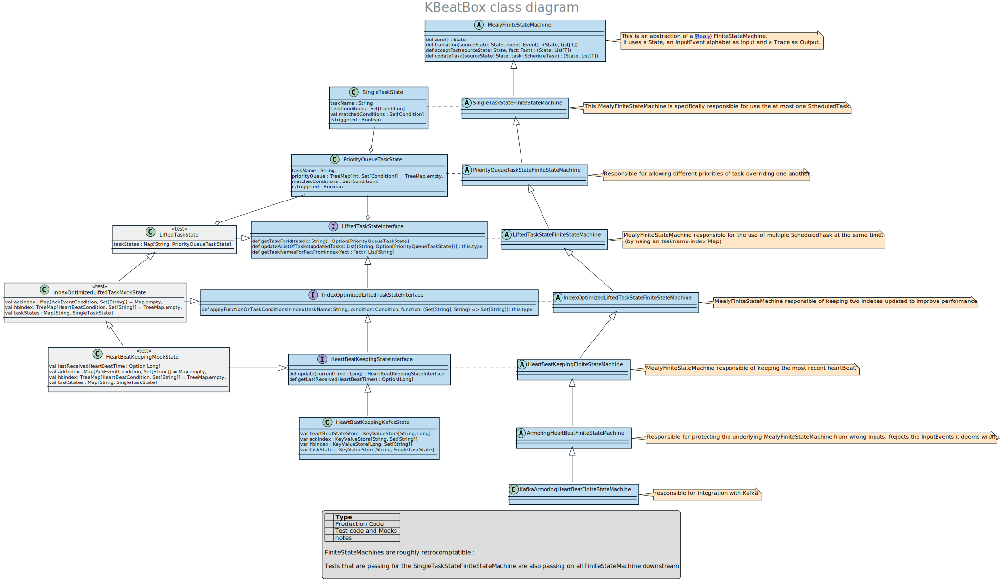

# kbeatbox
A Kafka scheduler, with focus on replayability and testability : logical time, deterministic.

## Design goal : Be able to test

Kafka is a fantastic to tool to replay your whole production.

## Architecture

The Finite State Machine used by kbeatbox is structured using layers :
 
  * Each layer is responsible for a specific purpose. For instance, Armoring deals only with armoring (rejecting incorrect inputs)

